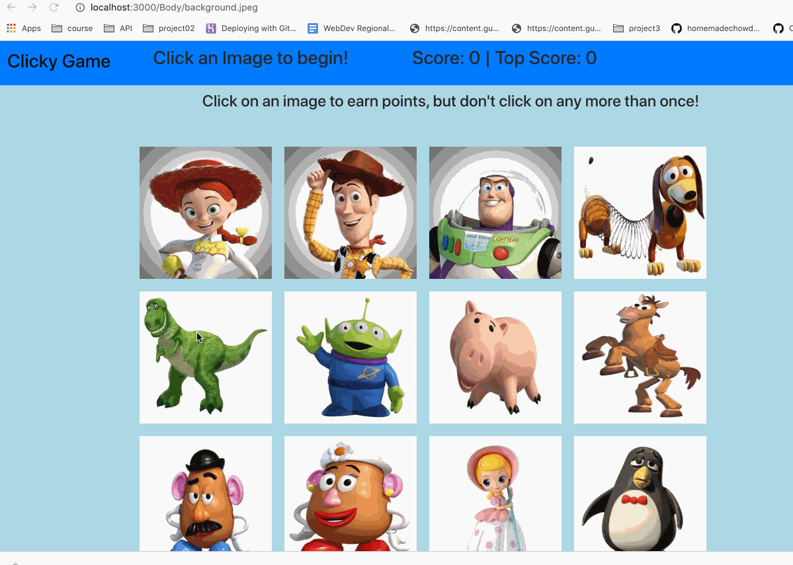

# clicky-game

Clicky Game (memory Game)

Technologies used:
HTML, 
CSS, 
Bootstrap, 
Javascript, 
Node.js, 
AJAX/JSON, 
JQuery, 
React js.

Heroku Link: 

This assignment is a game which has 12 images and on click of an image will increment your score, top score and shuffles the images.
once you have clicked on the same image again, your score will reset to zero and top score will remain the same until your score increases to the top score.

